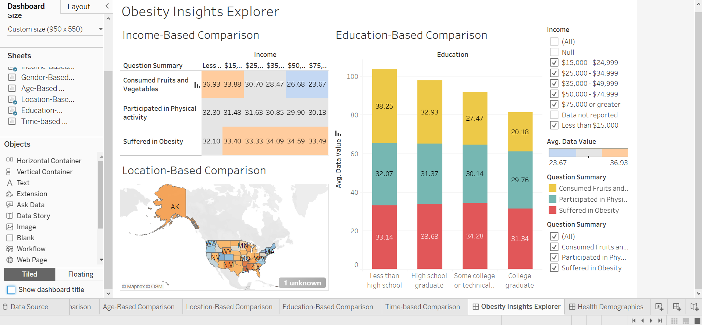
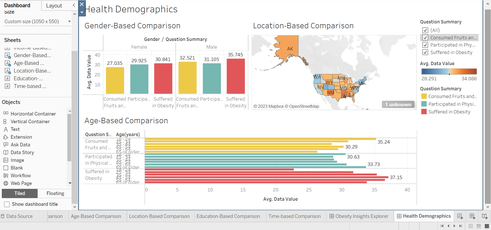

Obesity Insights and Decision Support System
Table of Contents
Project Overview
Features
Technologies Used
Installation and Setup
Dashboards and Visualizations
Results and Recommendations

1. Project Overview
This project uses Tableau to analyze obesity trends and identify factors influencing obesity rates using data 
from the Behavioral Risk Factor Surveillance System (BRFSS). Interactive dashboards provide insights across 
demographics and regions, enabling data-driven decision-making for obesity prevention and management.

---------------------------------------------------------------------------------------------------------------------

2. Features
Data Cleaning and Processing: Filtered BRFSS data for relevant years and columns.
Interactive Dashboards:
Obesity Insights Explorer: Analyzes income, education, and location factors.
Health Demographics Dashboard: Explores age, gender, and location trends.
Visualizations: Trend lines, heatmaps, bar charts, and symbol maps to represent data effectively.

---------------------------------------------------------------------------------------------------------------------

3. Technologies Used
Tableau: For creating dashboards and visualizations.
BRFSS Dataset: Public health data from the CDC.

----------------------------------------------------------------------------------------------------------------------

4. Installation and Setup
Pre-Requisites
Install Tableau Desktop or Tableau Public (free version) on your computer.
Have the processed BRFSS dataset available in a compatible format (e.g., .csv or .xlsx).
Steps
Clone this repository or download the project folder to your local system.
Open your Tableau file(s) included in this repository:
Ensure the Tableau files (.twb or .twbx) correspond to the visualizations described in the project 
(e.g., race-based, income-based, and time-based analyses).
Load the BRFSS dataset when Tableau prompts for data.
Interact with the visualizations to explore insights on obesity rates and related factors.

-----------------------------------------------------------------------------------------------------------------------

5. Dashboards and Visualizations

### Obesity Insights Explorer
Focus: Income, Education, and Location.
Features:
- Interactive map filters.
- Comparative visualizations for income and education trends.

### Health Demographics Dashboard
Focus: Age, Gender, and Location.
Features:
- Symbol maps for location-based trends.
- Line charts for time-based trends.
- Gender and age comparisons.

------------------------------------------------------------------------------------------------------------------------

6. Results and Recommendations
Key Findings:
Race-Based Trends: Asian individuals had the lowest obesity rates; Hawaiian individuals had the highest.
Income Trends: Obesity rates increased with income until mid-income brackets, then declined.
Location Trends: Mississippi had the highest obesity rates, Colorado the lowest.

Recommendations:
Cultural Interventions: Tailored to racial and ethnic groups.
Income-Sensitive Strategies: Affordable healthy food and activity options.
Localized Policies: Focused on high-obesity regions.
Educational Campaigns: Promote awareness of health behaviors.
